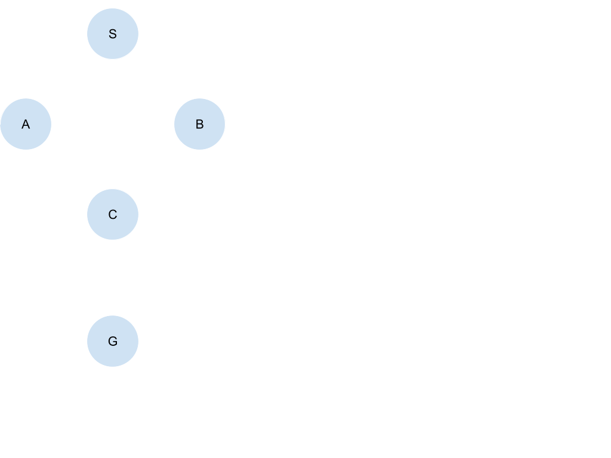

# Breadth First Search

A debugging task for the CAFE proto-study.
The participants are given a buggy implementation of Breadth First Search (BFS).
They debug it so that it passes the test case.

## Overview

The file [src/main.py](./src/main.py) contains an implementation of BFS over an undirected graph.
It does not currently pass the test case.
Your task is to find and fix the bug so the submission passes the test case.

## Files

| File/Directory                 | Purpose                                                         |
|:------------------------------ |:--------------------------------------------------------------- |
| `src/main.py`                  | The code you edit.                                              |
| `grader.py`                    | Autograder assignment/question definitions. **Do not look.**    |
| `assignment_control.json`      | Assignment config for the control (no-CAFE) run.                |
| `assignment_experimental.json` | Assignment config for the experimental (CAFE) run.              |
| `setup.sh`                     | Generates the solution profile used by CAFE.                    |
| `grade_control.sh`             | Grades your submission without CAFE feedback.                   |
| `grade_cafe.sh`                | Grades your submission with CAFE feedback enabled.              |
| `test-submissions/`            | Reference submissions **Do not look.**                          |

## Problem

Breadth First Search (BFS) is a graph traversal algorithm that explores nodes level by level, starting from a source node.
It first visits the source, then all nodes one edge away, then all nodes two edges away, and so on.
BFS uses a FIFO queue to decide which node to expand next.
In the case of a tie between nodes, we break the tie alphabetically.

The definition of an expanded node varies across sources.
For this proto-study, we consider a node expanded when it is removed from the queue and its neighbors are examined.

Because BFS explores nodes in order of distance from the source, the first time it reaches the goal it has found a path with the fewest edges.
In an unweighted graph, this is a shortest path.
(The path itself is recovered by storing a parent pointer for each node as it is discovered,
then following those pointers back from the goal to the source.)

Only modify the section marked with `TODO` in the [src/main.py](./src/main.py).

## Example

Graph used by the autograder (all edges undirected):

```
Input:  BFS(S, G)
Output: [S, A, C, G]
```

## Submitting an Attempt

Run all commands from this directory, inside your activated virtual environment
(see the repository root `README.md` for venv/requirements setup).
Each grading run logs a numbered attempt (submission copy + output log) under `attempts/`.

**Follow the instructions for your assigned group only.**

NOTE: To keep both implementations simple, we did not include a fail-safe for infinite loops.
If your code takes unusually long to finish after submission, it may be stuck in an infinite loop. You can press Ctrl+C to stop it.

### Control group (without CAFE)

```bash
./grade_control.sh
```

When ever you want to submit an attempt you can run the `grade_contorl.sh` script.
It will grade your current `src/main.py` and print autograder feedback.

### Experimental group (with CAFE)

Before you start debugging run the `setup.sh` once, it will produce `solution_profile.json`.
CAFE will use this file later so make sure you run this command.

```bash
# Build the solution profile.
./setup.sh
```

When ever you want to submit an attempt you can run the `grade_cafe.sh` script.
It will grade your current `src/main.py` and print autograder feedback and CAFE feedback.

```bash
./grade_cafe.sh
```
Note: The experimental run will take a little longer than usual due to profiling overhead. Thank you for your patience.

## Requirements

- Python >= 3.10
- Packages from the repository-root `requirements.txt`
